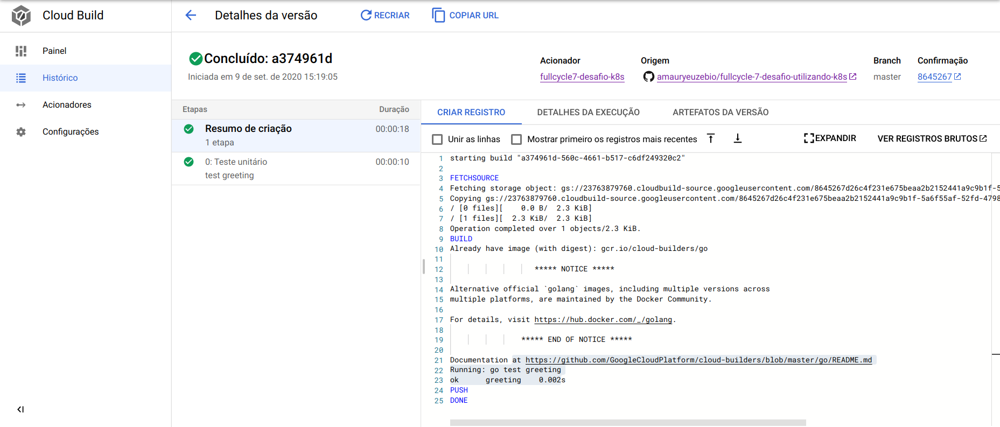

# Desafios FullCycle Turma 7
## Curso: Desenvolvimento de Aplicações Modernas e Escaláveis com Microsserviços

### Endereço imagem dockerhub

https://hub.docker.com/repository/docker/urameshe/desafio-k8s

### Resultado desafio de K8S.

